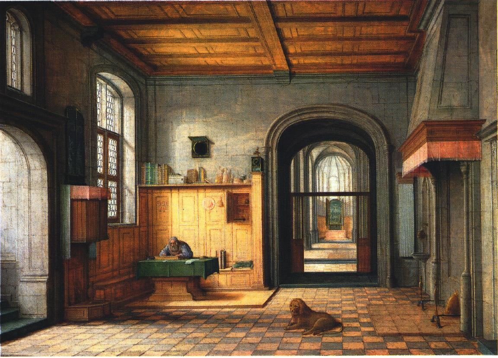

# Tour Into The Picture
This project constructs a 3D room from a 2D image.
## Instruction
Run the file main.m and follow the instruction in the app.
## Demo

  
  

## Source

http://graphics.cs.cmu.edu/courses/15-463/2006_fall/www/Papers/TIP.pdf

